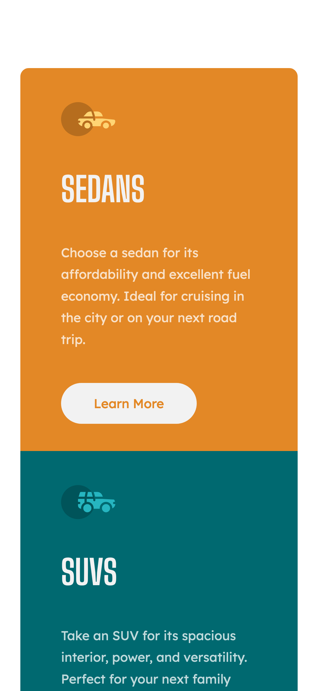
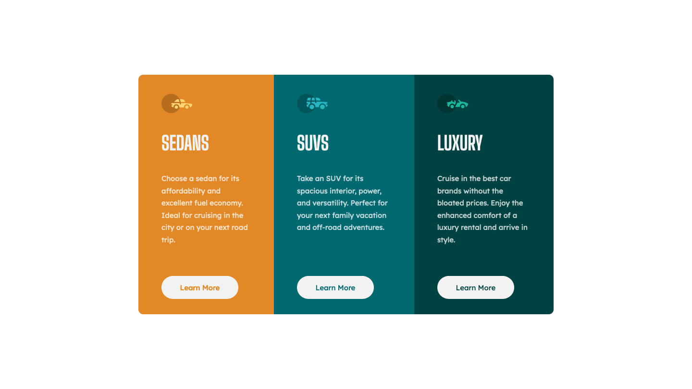

# Frontend Mentor - 3-column preview card component solution

This is a solution to the [3-column preview card component challenge on Frontend Mentor](https://www.frontendmentor.io/challenges/3column-preview-card-component-pH92eAR2-). 

## Table of contents

- [Frontend Mentor - 3-column preview card component solution](#frontend-mentor---3-column-preview-card-component-solution)
  - [Table of contents](#table-of-contents)
  - [Overview](#overview)
    - [The challenge](#the-challenge)
    - [Screenshot](#screenshot)
    - [Links](#links)
    - [Built with](#built-with)
  - [Author](#author)

## Overview
The challenge is to build out this 3-column preview card component and get it looking as close to the design as possible.

### The challenge

Users should be able to:

- View the optimal layout depending on their device's screen size
- See hover states for interactive elements

### Screenshot

!
| Mobile                                                                                | Desktop                                                                                 |
| ------------------------------------------------------------------------------------- | --------------------------------------------------------------------------------------- |
|  |  |

### Links

- Live Site URL: [https://rauf-dev.github.io/fm_3-column-preview-card-component-main/](https://rauf-dev.github.io/fm_3-column-preview-card-component-main/)

### Built with

- Semantic HTML5 markup
- CSS custom properties
- Flexbox
- Mobile-first workflow

## Author

- Website - [raUF!](https://www.heyrauf.com)
- Frontend Mentor - [@raUF!](https://www.frontendmentor.io/profile/yourusername)

